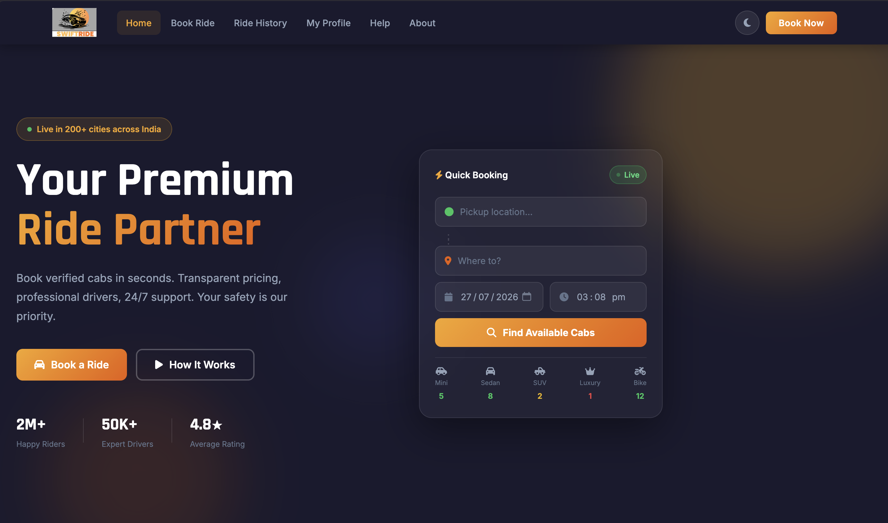
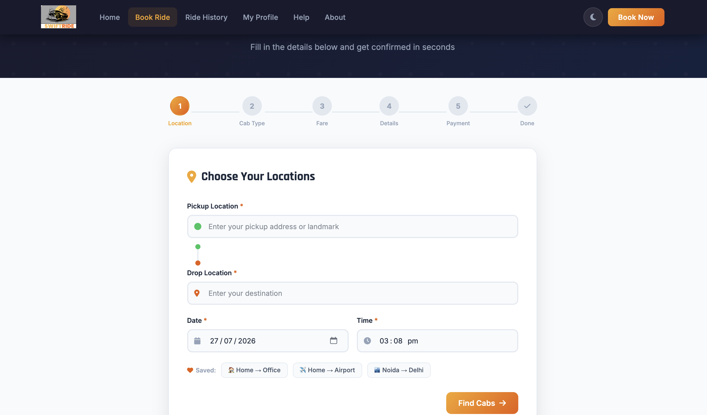
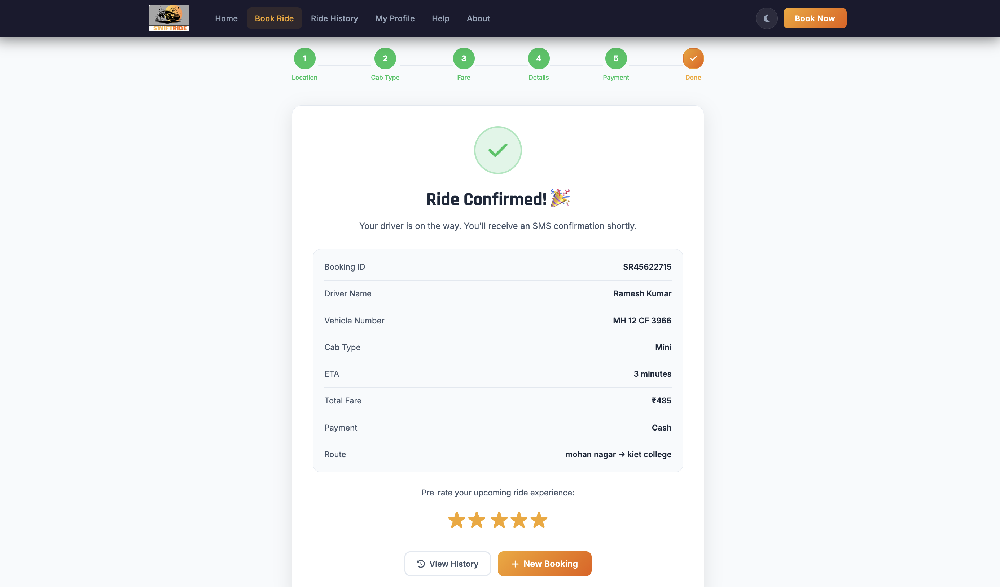

# 🚖 SwiftRide – Premium Cab Booking System


> A fully functional, professional cab booking web application built with pure HTML, CSS, and JavaScript — no frameworks, no dependencies. Features a complete 6-step booking flow, live fare calculation, dark mode, and fully responsive design.


---

## 📸 Screenshots

### 🏠 Home Page


---

### 📍 Book Ride — 6 Step Flow


---

### ✅ Booking Confirmation


---

## 📌 About The Project

**SwiftRide** is a premium cab booking web application designed to simulate a real-world ride-hailing platform. It includes everything from a hero landing page to a fully working multi-step booking system — all built using only vanilla HTML, CSS, and JavaScript with zero external dependencies or frameworks.

> 🎨 **The SwiftRide logo was self-designed by me using Canva** — including the brand identity, color palette (Amber & Orange), and overall visual style of the application.

This project was built to demonstrate:
- Clean UI/UX design principles
- Single Page Application (SPA) architecture without any framework
- Complete form validation and dynamic content rendering
- Brand identity creation from scratch
- Professional project structure suitable for production

---

## ✨ Key Features

### 🏠 Home Page
- Animated hero section with live cab availability widget
- Quick booking search card
- How It Works — 3-step process overview
- Fleet showcase with all 5 cab types
- Why SwiftRide — trust & safety highlights
- Promo code banner
- Customer testimonials
- Professional footer

### 📍 Book Ride — 6-Step Flow
| Step | Description |
|------|-------------|
| 1️⃣ Location | Enter pickup, drop, date & time with saved favourites |
| 2️⃣ Cab Selection | Choose from Mini, Sedan, SUV, Luxury, Bike Taxi |
| 3️⃣ Fare Estimate | Auto-calculated fare with promo code support |
| 4️⃣ Passenger Details | Name, phone, detailed addresses |
| 5️⃣ Payment | UPI, Google Pay, PhonePe, Paytm, Card, Cash |
| 6️⃣ Confirmation | Booking ID, driver name, vehicle number, ETA |

### 📜 Ride History
- View all past rides in card layout
- Filter by Completed / Cancelled
- One-click rebook any past ride
- Live ride stats (total rides, total spent)

### 👤 My Profile
- Edit name, phone, email
- Favourite saved locations (Home, Office, Airport)
- Recent payment history

### ❓ Help Center
- Searchable FAQ accordion
- 24/7 contact support details
- Emergency SOS number
- Safety tips section

### ℹ️ About Page
- Mission & Vision statements
- All services offered
- Company statistics

### 🌙 Dark / Light Mode
- Toggle between themes
- Preference saved in local storage

---

## 🗂️ Project Structure

```
SwiftRide-Cab-Booking-System/
│
├── index.html                  # Complete SPA — all 6 pages
│
├── css/
│   └── style.css               # Full styling, dark mode, animations, responsive
│
├── js/
│   └── app.js                  # Navigation, booking logic, validation, state
│
└── images/
    ├── logo.png                # ✏️ Self-designed brand logo (Canva)
    ├── screenshot-home.png     # Home page screenshot
    ├── screenshot-book.png     # Book ride screenshot
    └── screenshot-confirm.png  # Confirmation screenshot
```

---

## 🎨 Brand & Design

| Element | Details |
|---------|---------|
| **Logo** | Self-designed using **Canva** |
| **Primary Color** | Amber `#f5a623` |
| **Accent Color** | Orange `#e85d04` |
| **Dark Background** | `#1a1a2e` |
| **Typography** | Rajdhani (headings) + Inter (body) |
| **Design Style** | Modern, minimal, professional |

> 💡 The entire brand identity — logo, color palette, typography, and UI design — was conceptualized and created from scratch for this project.

---

## 🚀 Getting Started

### Prerequisites
- Any modern web browser (Chrome, Firefox, Safari, Edge)
- VS Code with Live Server extension *(recommended)*

### Run Locally

```bash
# 1. Clone the repository
git clone https://github.com/pooja21-chaturvedi/SwiftRide-Cab-Booking-System.git

# 2. Navigate into the folder
cd SwiftRide-Cab-Booking-System

# 3. Open index.html in your browser
#    OR right-click index.html in VS Code → Open with Live Server
```

> ✅ No npm install. No build step. No dependencies. Just open and run.

---

## 💡 Booking Flow

```
Home
 └── Enter Pickup & Drop Location
      └── Select Cab Type
           └── View Fare Estimate + Apply Promo
                └── Fill Passenger Details
                     └── Choose Payment Method
                          └── Booking Confirmed ✅
```

---

## 🎁 Promo Codes

| Code | Discount |
|------|----------|
| `FIRST50` | 50% OFF — First ride offer |
| `SWIFT20` | 20% OFF — Any ride |
| `RIDE10` | 10% OFF — Any ride |

---

## 🚖 Cab Types & Pricing

| Cab | Seats | Price | Best For |
|-----|-------|-------|----------|
| Mini | 4 | ₹15/km | Budget city rides |
| Sedan | 4 | ₹18/km | Daily commute |
| SUV | 6 | ₹22/km | Family & groups |
| Luxury | 4 | ₹35/km | Premium experience |
| Bike Taxi | 1 | ₹8/km | Beat traffic fast |

---

## 🛠️ Built With

| Technology | Usage |
|------------|-------|
| **HTML5** | Semantic structure, SPA page system |
| **CSS3** | Custom properties, flexbox, grid, animations |
| **Vanilla JavaScript** | DOM manipulation, routing, state management |
| **Font Awesome 6** | Icon library |
| **Google Fonts** | Rajdhani (display) + Inter (body) |
| **Canva** | Logo & brand identity design |
| **GitHub Pages** | Deployment & hosting |

---

## 📱 Responsive Breakpoints

| Device | Screen Size | Status |
|--------|-------------|--------|
| Mobile | 320px – 480px | ✅ Supported |
| Tablet | 481px – 768px | ✅ Supported |
| Laptop | 769px – 1024px | ✅ Supported |
| Desktop | 1025px+ | ✅ Supported |

---

## 🔮 Future Improvements

- [ ] Google Maps API integration for live route tracking
- [ ] Firebase backend for real bookings & authentication
- [ ] Driver app interface
- [ ] Push notifications for ride status
- [ ] PWA support for mobile install

---

## 👩‍💻 Author

**Pooja Chaturvedi**

[](https://github.com/pooja21-chaturvedi)

---

## 📄 License

This project is licensed under the **MIT License** — feel free to use, modify, and distribute.

---

<p align="center">
  <strong>⭐ If you found this project useful, please give it a star!</strong>
</p>

<p align="center">Made with ❤️ by Pooja Chaturvedi</p>
